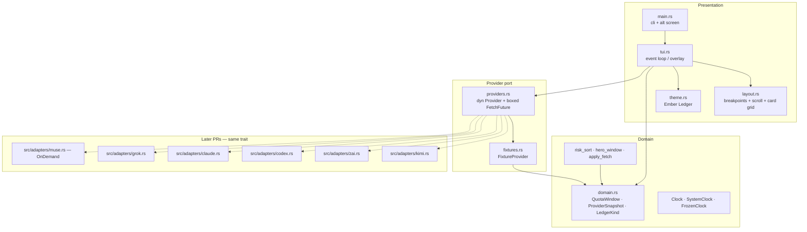

# Architecture

v1 is one process, in-memory snapshots, no daemon.



Refresh path (v1 fixtures already return a boxed future so HTTP adapters drop in):

```mermaid
sequenceDiagram
    actor User
    participant App as tui.rs
    participant Join as tokio JoinSet
    participant P as dyn Provider
    participant Snap as in-memory snapshots

    User->>App: launch / r / 60s timer
    alt already fetching
        App->>App: ignore timer; queue at most one extra r
    else idle
        App->>App: fetching = true (header spinner only)
        loop each provider whose RefreshPolicy allows this tick
            App->>Join: spawn timeout(10s, P.fetch())
        end
        Join-->>App: Result per id (status / timed out / panicked)
        App->>Snap: apply_fetch(prev, new_status) for that id only
        Note over App,Snap: Error with no stale inherits last Available
        App->>App: fetching = false; if r queued, fetch again; re-sort; render
    end
    User->>App: Enter → detail overlay on selected snapshot
```

**No SQLite. No background daemon.** Last **Available** snapshot stays on screen across failures. Render reads bars from that Available; the footer reads `stale` from `Error`.

## Language and crates (locked)

**Rust edition 2024** + **ratatui** + **crossterm** + **tokio**.

| Choice | Rationale |
| --- | --- |
| Rust 2024 / rust-version 1.85 | Single static-ish binary; no Node/Python runtime for an always-on pane. |
| ratatui + crossterm | Layout constraints, color control. Closest competitor is also ratatui — we study patterns, not their theme. |
| tokio (from PR4) | Parallel `fetch()`, timeouts, `EventStream` / `tokio::sync::mpsc`. |
| Boxed `FetchFuture` | Object-safe `dyn Provider`. RPITIT `impl Future` is **not** dyn-compatible. No `async-trait` crate (it expands to the same `Pin<Box<dyn Future>>`). |
| One crate | `crates/token-balance` only. No forest of crates in v1. |

Rejected stacks and the dispatch fork: [alternatives.md](alternatives.md).

Workspace resolver **3** (edition 2024 default).

Workspace and crate `Cargo.toml` set `license = "MIT OR Apache-2.0"` in PR1. Root `LICENSE-MIT` and `LICENSE-APACHE` ship in the same commit.

Two bin names, one `main.rs` (PR1):

```toml
[[bin]]
name = "token-balance"
path = "src/main.rs"

[[bin]]
name = "tb"
path = "src/main.rs"
```

`cargo run -p token-balance --bin token-balance -- --version` and `cargo run -p token-balance --bin tb -- --version` both print the version. `tb` is not a later alias.

Dependency ladder (root `AGENTS.md` says ask first — this design **is** that ask):

| PR | Crates | Why |
| --- | --- | --- |
| 1 | none (std only) | Version string via `env!("CARGO_PKG_VERSION")`. No clap. |
| 2 | `chrono` (`std`, `clock`, `serde`), `serde` (derive), `clap` (derive) | Domain + `--fixture`. Fixtures are Rust literals — **no `serde_json`**. |
| 3 | `ratatui` 0.29+, `crossterm`, `unicode-width` | TUI. `unicode-width` with **ambiguous width = 1**. |
| 4 | `tokio` (`macros`, `rt-multi-thread`, `time`, `sync`) | Event loop, `JoinSet`, 10s timeout. |
| 5 | `reqwest` (once) + `serde_json` | First live adapter. Later adapters **reuse** these. |

Not in v1: `keyring`, `rusqlite`, `prometheus`, `async-trait`, `color-eyre` (pretty panics fight the alt screen), `thiserror` (status messages are `String` until an adapter needs typed errors).

## Runtime loop

```text
main
  parse Cli { fixture: Option<FixtureSet>, command: init? }   # see cli.md
  clock = SystemClock (FrozenClock in tests / TestBackend)
  if init: write commented accounts.toml; exit 0
  if fixture: fixture_registry (does not read accounts.toml)
  else: live_registry from {HOME}/.config/token-balance/accounts.toml
        missing file → empty vec; invalid → stderr + exit 1
  enter raw mode + alt screen
  App { snapshots, selected_id, overlay, sort, fetching, refresh_queued, scroll, clock, live? }
  r on live path re-reads accounts.toml then fetches
  if fixture == Error { snapshots = mixed Available }  # seed, no paint
  first refresh (all)   # then first paint — never paint empty Error Codex
  loop tokio::select!
    EventStream / tokio mpsc → handle keys
    1s tick → redraw clock + countdowns (no fetch)
    60s tick → if !fetching { fetch Default policies }
    joinset completion → apply_fetch; if set empty { fetching=false; maybe queued r }
  restore terminal on any exit (Drop + panic hook)
```

Countdown strings (`in 1h 12m`) are computed at render from `Clock::now()` vs `resets_at`, not stored. Negative remaining time renders `reset due` (never `-Nd`).
